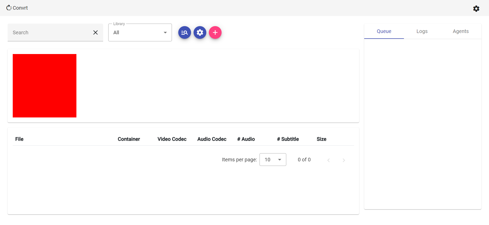

<!-- Header -->

   
  
  <!-- Logo -->
  

  <!-- Title -->
  ### Transmute
  
  <!-- Description -->
  Distributed Video Transcoding

  <!-- Repo badges -->
  
  
  

  <!-- Links -->
  ---
  

    <a href="https://git.zakscode.com/ztimson/Transmute/wiki" target="_blank">Documentation</a>
    • <a href="https://git.zakscode.com/ztimson/Transmute/releases" target="_blank">Release Notes</a>
    • <a href="https://git.zakscode.com/ztimson/Transmute/issues/new?template=.github%2fissue_template%2fbug.md" target="_blank">Report a Bug</a>
    • <a href="https://git.zakscode.com/ztimson/Transmute/issues/new?template=.github%2fissue_template%2fenhancement.md" target="_blank">Request a Feature</a>
  

  ---

## Table of Contents
- [Transmute](#top)
  - [About](#about)
    - [Built With](#built-with)
  - [Setup](#setup)
    - [Production](#production)
    - [Development](#development)
  - [License](#license)

## About

Transmute provides a simple web based tool to manage your video library. Transmute will watch a directory and automatically
transcode videos using [FFmpeg](https://ffmpeg.org/) & hardware acceloration (if available) so that your entire library 
meets a specified standard. In addition to transcoding, Transmute can also remove undesired audio tracks, subtitles, 
perform healthchecks & upscale/downscale video.

---

> Why do I care?

1. Transcoding `MPEG-2/MPEG-4` video to `h.264/h.265` can reduce file size by **50-90%**
2. A more extreme measure is downscaling `4K` to `1080p` to reduce size by a further **75%**
3. Stripping out unused audio tracks & subtitles can result in more savings
4. Some devices or players will be unable to play specific formats
5. If you use a self-hosted streaming service, your host will have to transcode videos on the fly when a device doesn't 
support the original format/resolution leading to choppy playback, transcoding your library ahead of time can avoid this
in most cases

> Why should I use this over __________?

Transmute's goal is to make the transcoding process as fast & simple as possible. Most transcoders provide hundreds of 
settings requiring some expertise to properly setup. With Transmute you simply specify what your video files should look
like & it will transcode your videos as lossless-ly as possible using multiple computers to make short work of large
libraries.

> How does it work?

After choosing your desired settings & creating a new library in the WebUI, the server will begin scanning videos to 
collect metadata. If this metadata doesn't match your settings or a healthcheck is required, the server will queue a job.

Once a worker is available, it will request a job from the server & complete it using FFmpeg.

### Built With

## Setup

  <h3 id="production" style="display: inline">Production</h3>

#### Prerequisites
- [Docker](https://www.docker.com/products/docker-desktop/)

#### Instructions
1. Download the [example compose file](https://gitlab.zakscode.com/zakscode/transmute/transmute/-/blob/main/docker-compose.yml) on your server: `curl -o transmute.yml https://gitlab.zakscode.com/zakscode/transmute/transmute/-/raw/main/docker-compose.yml`
2. Read the [Configuration Guide](https://gitlab.zakscode.com/zakscode/transmute/transmute/-/wikis/home) & edit the compose file accordingly
3. Run the compose file:
    - Using Docker Compose: `docker compose -f transmute.yml up`
    - Using Docker Swarm: `docker stack deploy transmute -c transmute.yml`

  <h3 id="development" style="display: inline">Development</h3>

#### Prerequisites
- [Git](https://git-scm.com/downloads)
- [Node](https://nodejs.org/en/download)
- [FFmpeg](https://ffmpeg.org/download.html)
- [Docker](https://www.docker.com/products/docker-desktop/)

#### Instructions
1. Clone this project: `git clone `
2. Pull the submodules: `git submodule update --remote --init`
3. Checkout the latest: `git submodule foreach git switch develop`
4. Install dependencies: `git submodule foreach npm i`
5. Link common:
	1. Link common to npm: `cd common && npm link`
	2. Link common to client (re-run after every `npm install`): `cd ../client && npm link @transmute/common`
	3. Link common to server (re-run after every `npm install`): `cd ../server && npm link @transmute/common`
	4. Link common to worker (re-run after every `npm install`): `cd ../worker && npm link @transmute/common`
6. Start each project as needed:
	- Start common: `cd ../common && npm run watch`
	- Start client: `cd ../client && npm run start`
	- Start server: `cd ../server && npm run start`
	- Start worker: `cd ../worker && npm run start`

## License
Copyright © 2023 Zakary Timson | Available under MIT Licensing

See the [license](./LICENSE) for more information.
